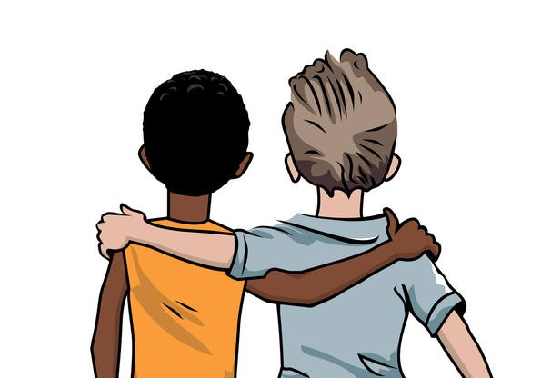

 

#Dream Team 2.0

Spencer Abbott. I come from a small town with a family of coder's. My dad works for a company called xello and my mom works for my dad. My older brother is taking computer sicence at fanshawe and use's code like C++. I like sports, hockey, video games and hopefully coding.

 Myself Haem Hariharan from India and doing IDP course to learn coding and Design fundamentals to apply for the future UI & UX in Virtual reality.

## Contributing

1. Fork it!
2. Create your feature branch: `git checkout -b my-new-feature`
3. Commit your changes: `git commit -am 'Add some feature'`
4. Push to the branch: `git push origin my-new-feature`
5. Submit a pull request :D

## Credits

 ### Spencer Abbott

### Haem Hariharan 

## License

MIT

## New live New Begining

education uplift everyone
